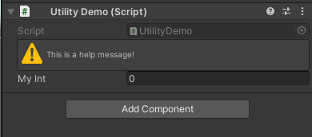

# BazzaGibbs Utility

Common utility classes for Unity.

Full documentation is WIP.

## Installation

### Option A: Scoped Registry

All my public/open source packages are hosted on [my registry](https://registry.bazzagibbs.com).

1. Install a Scoped Registry: `Project Settings > Package Manager > Scoped Registries`
```
Name:       BazzaGibbs
URL:        https://registry.bazzagibbs.com
Scope(s):   com.bazzagibbs
```
2. In the Package Manager, select "Add package by name", `com.bazzagibbs.utility`

### Option B: Git URL

Adding packages by Git URL has the downside of not properly displaying when there is a package update available.

1. In the Package Manager, select "Add package from git URL", `https://github.com/Bazzas-Personal-Stuff/BazzaGibbsUtility.git`

## Features

- [Vector Extensions](#vector-extensions)
- [HelpBox Decorator Attribute](#helpbox-decorator-attribute)

### Vector Extensions

- `Vector2.ToTopDown() -> Vector3`
- `Vector3.FromTopDown() -> Vector2`

### HelpBox Decorator Attribute

Add help text boxes without a PropertyDrawer or custom editor.

```csharp
public class UtilityDemo : MonoBehaviour {
    [HelpBox("This is a help message!", HelpBoxMessageType.Warning)]
    public int myInt;
}
```


Credit: Tony Li

